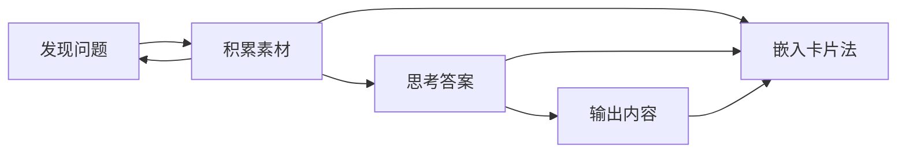
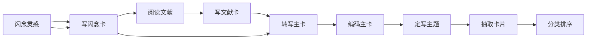

# zettelkasten-permanent
## 工作流程
### 卢曼工作流程


卢曼卡片法流程

### 卡片笔记工作流程
```mermaid
1[闪念灵感]
2[写闪念卡]
3[阅读文献]
4[写文献卡]
5[转写主卡]
6[编码主卡]
7[定写主题]
8[抽取卡片]
9[分类排序]

```

*记永久笔记(permanent)*
1. 仔细阅读第一步第二步记录的闪念笔记和文献笔记(最好每天一次，或者是在你忘记为什么记它们之前)，并思考它们与我们的研究、思考和兴趣的内容有什么关联。因为这里面只包含了我们感兴趣的东西，所以在这一步骤很快能完成。
2. 记录这些笔记不是为了收集，而是为了帮助思考、衍生想法论点以及引起讨论。
3. 新的信息是否和卡片盒以及脑海中已有的信息相互矛盾、相互印证、相互一致或相互补充？是否能把已有的想法结合起来产生新的想法？这些想法又引起了什么问题？可以为每一个想法准确地记下一条笔记，并像为别人写作一样(别人能看懂，跟第一步不一样，第一步记录闪念笔记只需自己能看懂就行)，使用完整的句子，标注来源，提供参考资料，并尽量做到精确、清晰和简短。
4. 当闪念笔记转化为永久笔记时，就可以扔掉第一步记录的闪念笔记。第二步记录的文献笔记转化为永久笔记之后，可以将文献笔记放入文献管理系统
5. 把重要东西记入卡片盒中就可以忘记它们了。

## 记永久笔记实践
```mermaid
flowchart
```


## 索引
[编码索引表](cardcode.idx.md)
[关键词索引卡](keyword.idx.md)
[主题索引卡](all.topic.idx.md)
[集合索引卡](all.collection.idx.md)

